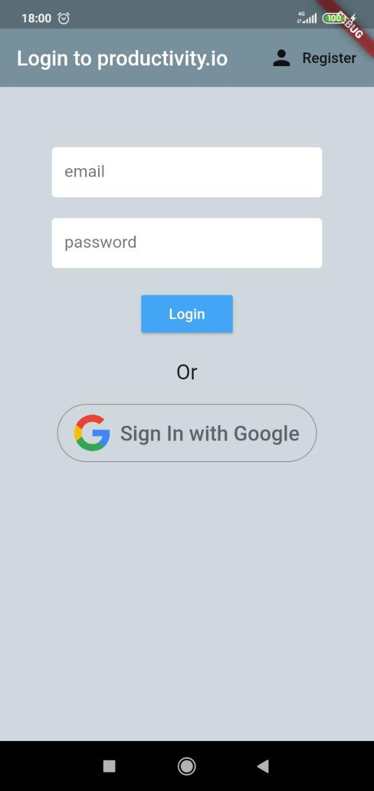
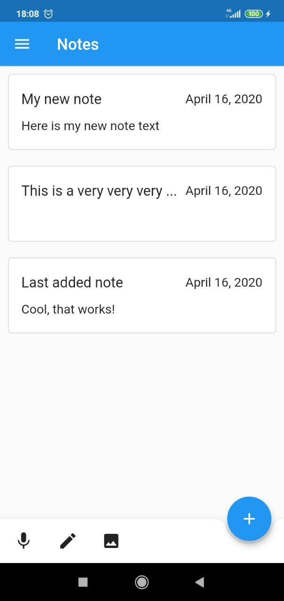
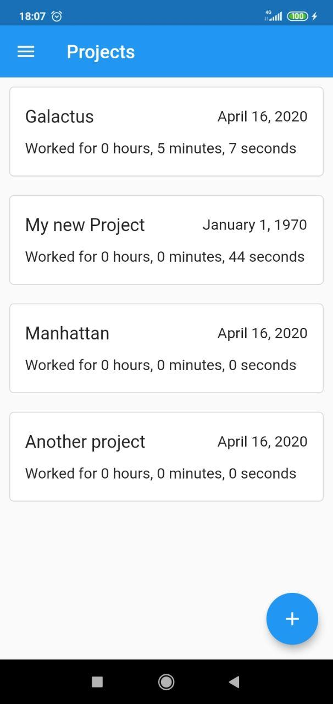
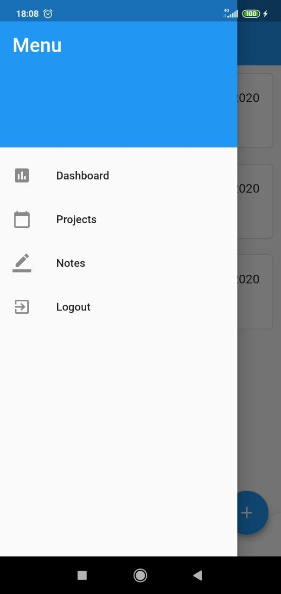
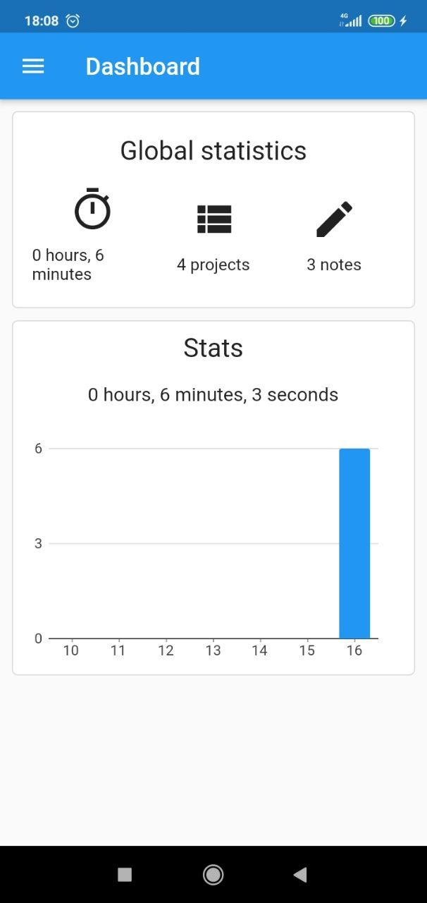

# productivity.io

Productivity.io is a time tracker and todo app with a sole goal of increasing your productivity.
It has long been known that the best productivity could be reached when you are working on
some problem in a big chunk of uninterrupted time, usually 3-5 hours. Therefore in order to increase
productivity you have to increase the number of such working chunks. The app will allow you to
track time intervals during the week, and provide possibility for writing actionable notes/todo lists.

## Features

- schedule working intervals for the week
- receive notifications when it is time to start working
- create planning notes
- add photos / todo lists to the notes
- statistics dashboards with number of working intervals on a weekly/monthly basis

## Technologies

- Flutter
- Firebase
- Google Cloud Functions

## Author

Vladyslav Mokrousov

## Screenshots

### Login

### Notes

### Projects

### Project

### Drawer

### Dashboard

